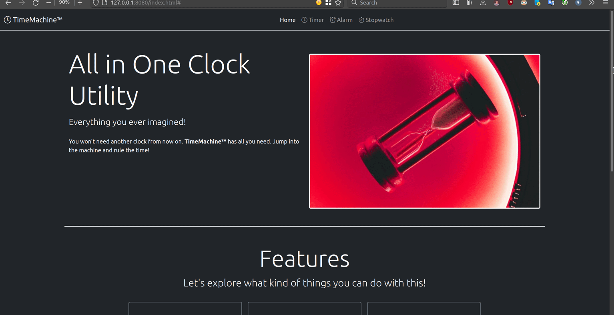
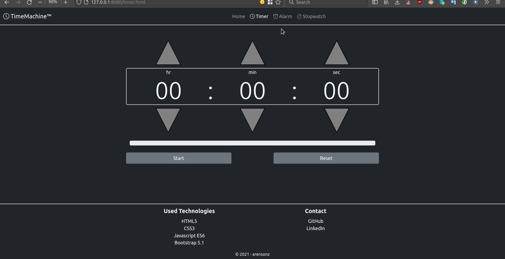
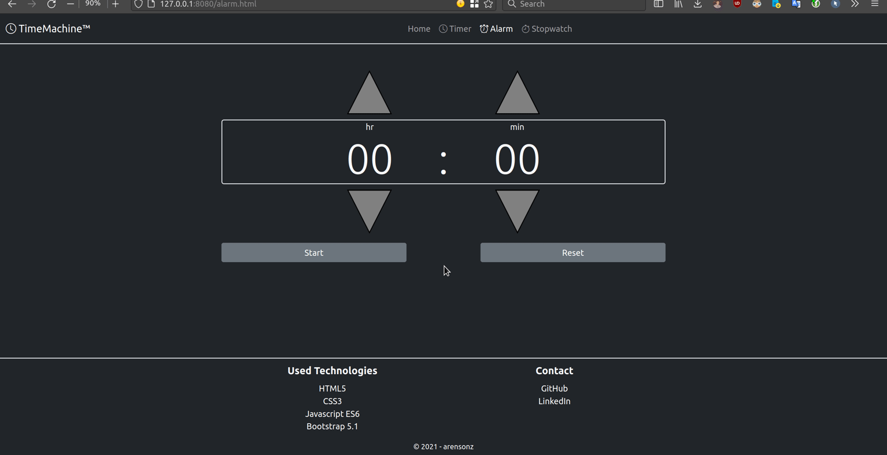
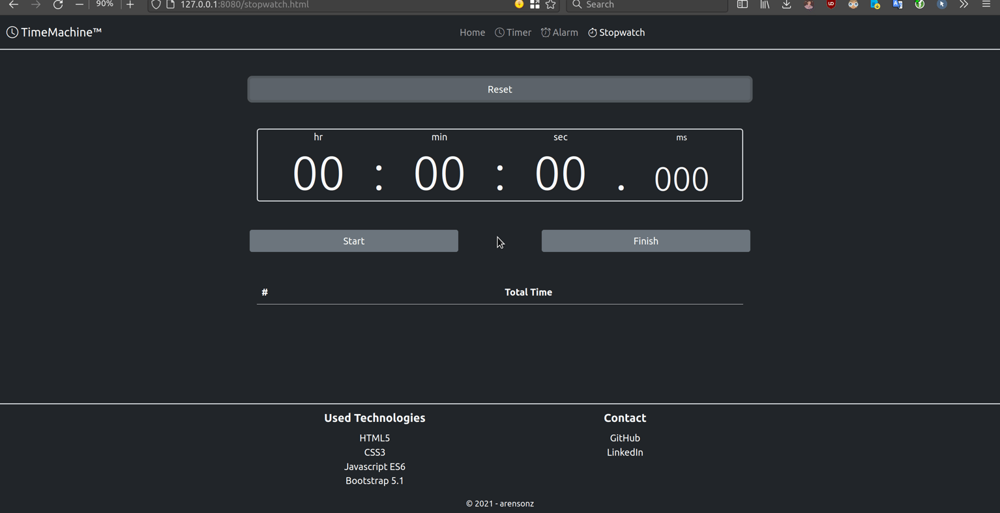

# Web Clock App

All in one alarm, timer an stopwatch written in HTML, CSS and JS. Bootstrap icons and components are also used.

<!-- START doctoc generated TOC please keep comment here to allow auto update -->
<!-- END doctoc generated TOC please keep comment here to allow auto update -->

## Requirements

* npm

## Running Server Locally

1. Install a HTTP server app to be able to serve static files.
    ```sh
    npm install -g http-server
    ```
1. Start the server.
    ```sh
    http-server
    ```
1. Access the application from browser
    ```sh
    http://localhost:8080
    ```

## Features

* Index page with hero section and cards
    

* Timer page
    

* Alarm page
    

* Stopwatch page
    

## Technologies

* HTML5
* CSS3
* JavaScript
* [Bootstrap 5.1](https://getbootstrap.com/docs/5.1/getting-started/introduction/) CSS framework
* [Bootstrap Icons](https://icons.getbootstrap.com/)
